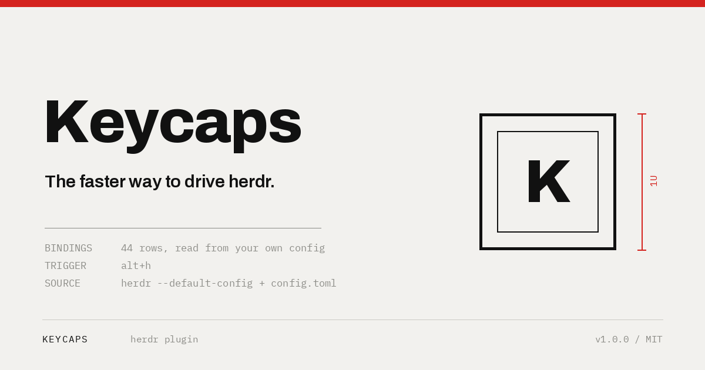
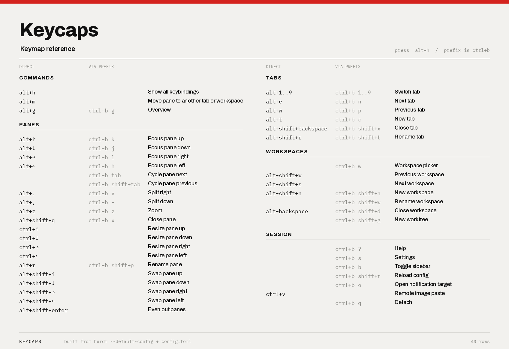

<p align="center">
  
</p>

# Keycaps

The faster way to drive herdr.

Keycaps keeps your hands on the keyboard. One key shows every binding currently
in effect, ordered by how often you reach for it, so you stop guessing at
chords you set up weeks ago and stop breaking flow to look them up. A few more
keys do the pane work herdr only exposes on the command line: send a pane to
another tab or workspace, swap it with its neighbour, even out the splits.

Nothing to configure beyond the bindings you want. The list builds itself from
your own config, so it is right the moment you change a key.

<p align="center">
  
</p>

Your own commands come first. Herdr's config order opens with help, settings
and detach, which pushes pane and tab movement off the bottom of the popup.

Chords are coloured and sections bold, using ANSI 16-colour codes only, so the
popup resolves through the terminal's own palette and follows whatever herdr
theme is active. Set `NO_COLOR=1` to turn that off; piped output is plain
either way.

Three columns, and the title doubles as their heading: **KEYCAPS** is what your
config adds, **PREFIX** is herdr's stock binding for the same action. Keeping
them apart means the chord you actually reach for lines up down the page
instead of being pushed around by longer prefix forms. An action with nothing
under KEYCAPS is one still waiting for a direct chord. `prefix+h` is spelled out
as `ctrl+b h`. The space is deliberate, because the prefix is released before
the next key is pressed, so no row needs a second lookup.

## Install

```sh
herdr plugin install macd2/herdr-keycaps
```

Then bind it in `~/.config/herdr/config.toml`:

```toml
[[keys.command]]
key = "alt+h"
type = "plugin_action"
command = "macd2.keycaps.show"
description = "Show all keybindings"
```

```sh
herdr server reload-config
```

The binding names the plugin, not a script path, so this block is identical on
every machine.

## Attaching from a remote client

**If you attach with `herdr --remote`, you must pass `--remote-keybindings server`
or nothing in this plugin will work.**

```sh
herdr --remote <target> --remote-keybindings server
```

`herdr --remote` uses your **local** keybindings by default, and local custom
command bindings are never sent to the remote host. A binding for this plugin
only fires when the server's keyset is the active one.

This fails silently, which is what makes it worth knowing: `herdr config check`
prints `config: ok`, `herdr server reload-config` reports `applied`, the plugin
links fine and lists its actions. No key does anything. There is no
warning anywhere to tell you the config you just edited is being ignored.

## Moving panes

Herdr can move and swap panes from the CLI but exposes no keybinding actions
for either. `move_tab_previous` and `move_tab_next` move whole tabs, not panes.
These bindings close that gap:

```toml
[[keys.command]]
key = "alt+m"
type = "plugin_action"
command = "macd2.keycaps.move"
description = "Move pane to another tab"

[[keys.command]]
key = "alt+shift+h"          # and j / k / l
type = "plugin_action"
command = "macd2.keycaps.swap-left"
description = "Swap pane left"
```

`alt+m` opens a picker: arrows or `j`/`k` to move, a number to jump straight
there, Enter to confirm, `q` or Esc to cancel. Destinations are grouped by
workspace, so a pane can cross into another one:

```
  MOVE PANE  pick a destination

  Redesign
  › 1  Claude1  (2 panes)
    2  a new tab here

  Infra
    3  Notes  (1 pane)
    4  a new tab here

    5  a new workspace
```

Headings are not selectable and the cursor skips them. The tab the pane is
already in is never offered. "a new tab here" carries the workspace it sits
under, so it lands there rather than in whichever workspace has focus.

A tab id already names its workspace, so crossing workspaces needs only
`--tab`; `--workspace` is for `--new-tab`.

Moving into an existing tab passes `--split right`, because herdr rejects
`--tab` without a placement. That tab already has panes, so it needs to know
where yours lands.

`alt+shift+h/j/k/l` swap the focused pane with its neighbour. Hold the same
direction and the pane keeps walking that way; at the edge it wraps round to
the far end rather than stopping dead, so a row behaves as a closed cycle:

```
  press 1   [D, C, A]
  press 2   [D, A, C]   at the right edge
  press 3   [C, D, A]   wrapped to the far left
```

Herdr reports a missing neighbour as `changed: false` with exit code 0, not as
an error, and that is the cue to wrap. The walk back is bounded so a
misbehaving swap cannot spin forever.

## Evening out panes

`alt+shift+e` sets every split in the tab back to half. Herdr has no action,
keybinding or CLI for this. `pane resize` only shifts a divider by a relative
amount, so this one goes through the socket API's `layout.set_split_ratio`:

```toml
[[keys.command]]
key = "alt+shift+e"
type = "plugin_action"
command = "macd2.keycaps.even"
description = "Even out panes"
```

A split is addressed by the path taken to reach it: `[]` is the root, then
`false` descends into `first` and `true` into `second`. The protocol is
newline-delimited JSON over `~/.config/herdr/herdr.sock`.

## How it works

Herdr has no CLI that dumps resolved keybindings. The action list and its
defaults live in `herdr --default-config`, where every action appears as a
commented `# action = "binding"` line, and `config.toml` overrides those.
Keycaps does that merge and renders it.

Keybindings can only target plugin *actions*, never plugin *panes*, so:

```
alt+h  ->  action "show"  ->  show.py  ->  herdr plugin pane open
                                             -> pane "keys" (popup)
                                                  -> keycaps.py
```

`placement = "popup"` lives in the manifest rather than on the open request,
because the CLI's `--placement` flag has no `popup` value. The popup closes
when the pager exits, so the pager deliberately does not pass `less -F`: the
list often fits one screen, and `-F` would flash the popup open and shut.

An action that no group knows about still renders, under `OTHER`, so a binding
added by a future herdr release is never silently dropped.

## Tests

```sh
python3 tests/test_grouping.py     # group order, custom first, unknown actions kept
python3 tests/test_popup_pager.py  # stays open on a real pty, exits 0 on q
python3 tests/test_show_action.py  # action opens the right pane, opens no popup
```

Each cleans up after itself; none opens a popup in a live session.

## License

MIT

## Assets

`assets/render.py` draws the logo, banner and reference card. The banner is
1200x630, the format herdr uses for its own card.

The visual system is Instrument: paper ground, hairline drawing, and one red
that only ever marks a measurement. The keycap is drawn orthographically rather
than rendered, so the mark is the same object at any size.

Archivo sets the wordmark and IBM Plex Mono the specification blocks, both
vendored under `assets/fonts/` with their OFL licences so the assets rebuild
anywhere.

The reference card is typeset from `keycaps.entries()`, the same rows the popup
formats, so a published card cannot drift from the plugin. Its column widths
are measured from the longest entry rather than fixed, and the sections are
split across the two columns on whole groups.

```sh
python3 assets/render.py
```
